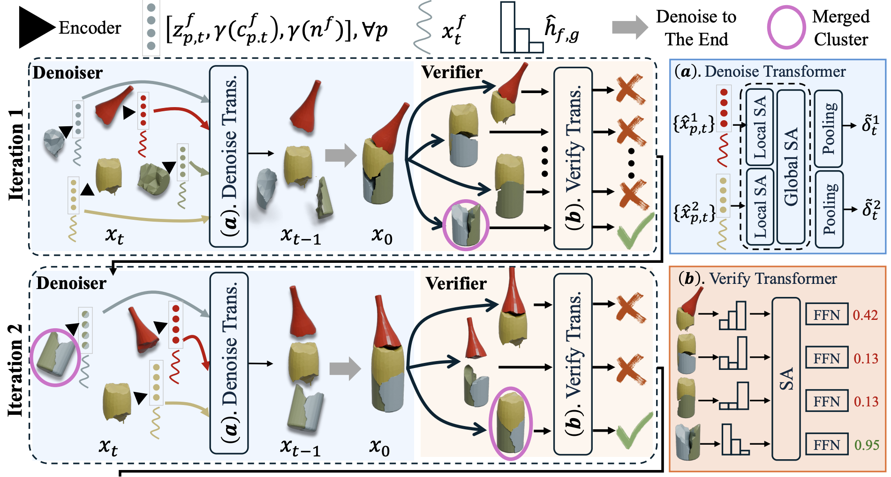

<div align="center">
<h1 align="center"> PuzzleFusion++: Auto-agglomerative 3D Fracture <br/> Assembly by Denoise and Verify
</h1>


### [Zhengqing Wang*<sup>1</sup>](https://eric-zqwang.com/) , [Jiacheng Chen*<sup>1</sup>](https://jcchen.me) , [Yasutaka Furukawa<sup>1,2</sup>](https://www2.cs.sfu.ca/~furukawa/)

### <sup>1</sup> Simon Fraser University <sup>2</sup> Wayve

### [arXiv](https://arxiv.org/abs/2406.00259), [Project page](https://puzzlefusion-plusplus.github.io/)

</div>


<!-- https://github.com/woodfrog/maptracker/assets/13405255/1c0e072a-cb77-4000-b81b-5b9fd40f8f39 -->


This repository provides the official implementation of the paper [PuzzleFusion++: Auto-agglomerative 3D Fracture Assembly by Denoise and Verify](https://arxiv.org/abs/2406.00259).

## Table of Contents
- [Introduction](#introduction)
- [Model Architecture](#model-architecture)
- [Installation](#installation)
- [Data preparation](#data-preparation)
- [Getting Started](#getting-started)
- [Acknowledgements](#acknowledgements)
- [Citation](#citation)
- [License](#license)

## Introduction
This paper proposes a novel “auto-agglomerative” 3D fracture assembly method, PuzzleFusion++, resembling how humans solve challenging spatial puzzles.

Starting from individual fragments, the approach 1) aligns and merges fragments into larger groups akin to agglomerative clustering and 2) repeats the process iteratively in completing the assembly akin to auto-regressive methods. Concretely, a diffusion model denoises the 6-DoF alignment parameters of the fragments simultaneously, and a transformer model verifies and merges pairwise alignments into larger ones, whose process repeats iteratively.

Extensive experiments on the Breaking Bad dataset show that PuzzleFusion++ outperforms all other state-of-the-art techniques by significant margins across all metrics. In particular by over 10% in part accuracy and 50% in Chamfer distance.


## Model Architecture




## Installation

Please refer to the [installation guide](docs/installation.md) to set up the environment.


## Data preparation


## Getting Started


<!-- ## Acknowledgements

We're grateful to the open-source projects below, their great work made our project possible:
* [PuzzleFusion](https://github.com/sepidsh/PuzzleFussion)
* [Jigsaw](https://github.com/Jiaxin-Lu/Jigsaw) -->


## Citation

If you find PuzzleFusion++ useful in your research or applications, please consider citing:

```
@article{wang2024puzzlefusionpp,
  author    = {Wang, Zhengqing and Chen, Jiacheng and Furukawa, Yasutaka},
  title     = {PuzzleFusion++: Auto-agglomerative 3D Fracture Assembly by Denoise and Verify},
  journal   = {arXiv preprint arXiv:2406.00259},
  year      = {2024},
}
```

## License

This project is licensed under GPL, see the [license file](LICENSE) for details.